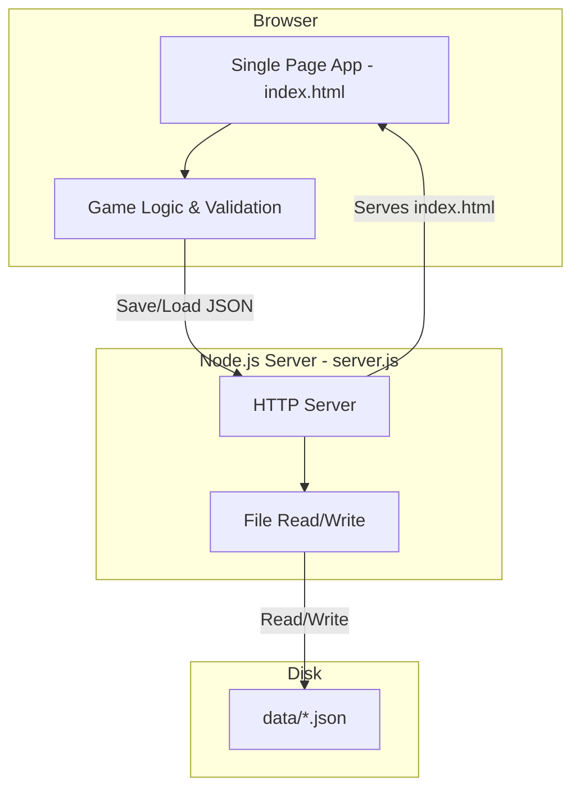

# Design Document: 1846 Board Game Score Tracker

## Overview

The 1846 Score Tracker is a two-tier application: a zero-dependency Node.js HTTP server and a single-file HTML/CSS/JS client. The server's only job is to serve the HTML file and provide a thin persistence layer for reading/writing JSON session files to disk. The client is a single-page app that manages all game state in memory, performs all validation and game logic client-side, and saves the full state to disk via the server whenever something changes.

The architecture is intentionally simple — no frameworks, no build step, no bundler, no REST API. The server uses only Node.js built-in modules (`http`, `fs`, `path`, `child_process`). The client uses vanilla JavaScript with DOM manipulation.

### Key Design Decisions

1. **Single HTML file**: All markup, styles, and scripts live in one `index.html`. This keeps deployment trivial and avoids any build tooling.
2. **JSON file per session**: Each game session is a separate `.json` file in a `data/` directory. This makes persistence simple and debuggable — you can inspect game state with any text editor.
3. **Client-side logic, server-side storage**: All game logic, validation, and calculations happen in the browser. The server is just a dumb file read/write layer. This keeps the server trivially simple.
4. **1846 game data as constants**: The predefined company list, share price chart, and IPO price list are hardcoded constants in the client.

## Architecture



### Request Flow

1. User interacts with the UI (e.g., distributes revenue)
2. Client-side game logic validates and applies the change to the in-memory state
3. Client sends the full updated session JSON to `POST /save/:id`
4. Server writes the JSON to `data/{id}.json`
5. Client re-renders from its local state

## Components and Interfaces

### Server Components

#### `server.js` — Entry Point & HTTP Server

The single server file. Minimal responsibilities:
- Starting the HTTP server on a configurable port (default 3000, overridable via `PORT` env var)
- Serving `index.html` on `GET /`
- Providing a thin file persistence API (list, load, save, delete)
- Opening the browser on startup
- Graceful shutdown on SIGINT/SIGTERM

#### Server Endpoints

| Method | Path | Description | Requirements |
|--------|------|-------------|--------------|
| GET | `/` | Serve `index.html` | 10.2 |
| GET | `/list` | Return array of `{id, filename}` for all session files | 9.1 |
| GET | `/load/:id` | Read and return a session JSON file | 9.2, 8.2 |
| POST | `/save/:id` | Write request body as JSON to session file | 2.5, 3.9, 4.4, 5.6, 8.1, 11.4 |
| DELETE | `/delete/:id` | Delete a session file | 9.3 |

The server does NO validation — it's a pure file read/write proxy. All validation lives in the client.

#### File Persistence Layer

- Reads/writes JSON files in `./data/` directory
- Creates `./data/` on startup if it doesn't exist
- Each session file: `data/{id}.json`
- All writes are synchronous to avoid race conditions (acceptable for single-user local app)

### Client Components

#### `index.html` — Single Page Application

All client code lives in one HTML file with embedded `<style>` and `<script>` tags.

**Views** (toggled via JS, no routing library):
- **Home View**: List of saved sessions + "New Game" button
- **New Game View**: Form to enter player names and initial bank amount
- **Game View**: The main game tracking interface with sections for:
  - Round/phase indicator
  - Bank pool display
  - Player standings (sorted by wealth)
  - Company cards (share price, chairman, treasury, revenue)
  - Shareholding matrix (players × companies)

**Client State Management**:
- Single `gameState` object in memory
- All game logic and validation runs client-side
- Every mutation triggers: validate → update local state → `POST /save/:id` → re-render
- No server round-trip needed for rendering — saves are fire-and-forget for persistence

### Game Constants Module

Shared between server validation and client display:

```javascript
const COMPANIES = [
  'Pennsylvania Railroad', 'New York Central', 'Erie',
  'Baltimore & Ohio', 'Chesapeake & Ohio', 'Illinois Central',
  'Grand Trunk'
];

const SHARE_PRICE_CHART = [
  0, 10, 20, 30, 40, 50, 60, 67, 71, 76, 82, 90, 100,
  112, 124, 137, 150, 165, 180, 195, 212, 230, 250, 270,
  295, 320, 345, 375, 405, 440, 475,510, 550
];

const IPO_PRICES = [40, 50, 60, 70, 80, 90, 100, 112, 124, 137, 150];

const PHASES = ['Stock Round', 'Operating Round 1', 'Operating Round 2'];
```

> Note: These values are based on standard 1846 rules. The exact share price chart values will be confirmed during implementation.

## Data Models

### GameSession

```javascript
{
  id: string,              // UUID
  createdAt: string,       // ISO 8601 timestamp
  updatedAt: string,       // ISO 8601 timestamp
  bankPool: number,        // Current bank amount
  round: number,           // Current game round (1-based)
  phase: string,           // 'Stock Round' | 'Operating Round 1' | 'Operating Round 2'
  players: [
    {
      name: string,        // Player name
      cash: number         // Personal cash on hand
    }
  ],
  companies: [
    {
      name: string,        // From COMPANIES list
      sharePrice: number,  // From SHARE_PRICE_CHART
      chairman: string,    // Player name
      treasury: number,    // Company cash
      lastRevenuePerShare: number | null  // Latest revenue per share, null if never operated
    }
  ],
  shareholdings: {
    // "PlayerName:CompanyName" -> number of shares
    // e.g. "Alice:Erie" -> 3
  }
}
```

**Design rationale for shareholdings**: A flat map keyed by `"PlayerName:CompanyName"` is simpler to serialize, query, and update than nested arrays. It also makes revenue distribution straightforward — iterate over all keys matching a company, multiply shares by revenue per share.

### Validation Rules (Client-Side)

| Field | Rule | Requirement |
|-------|------|-------------|
| `players` | Length >= 2 | 2.2 |
| `players[].name` | Non-empty, non-whitespace | 2.3 |
| `bankPool` | Positive number | 2.4 |
| `companies[].name` | Must be in `COMPANIES` list | 3.1 |
| `companies[].sharePrice` | Must be in `SHARE_PRICE_CHART` | 3.4, 3.5 |
| `shareholdings[*]` | Non-negative integer | 4.2 |
| Revenue input | Non-negative number | 5.4 |

### Revenue Distribution Algorithm

```
distributeRevenue(session, companyName, totalRevenue):
  company = findCompany(session, companyName)
  totalShares = sum of all shareholdings for companyName
  if totalShares == 0: return error
  revenuePerShare = floor(totalRevenue / totalShares)
  
  for each (playerName, shares) in shareholdings for companyName:
    player.cash += shares * revenuePerShare
  
  session.bankPool -= totalRevenue
  company.lastRevenuePerShare = revenuePerShare
  persist(session)
```

### Wealth Calculation

```
playerWealth(player, session):
  wealth = player.cash
  for each company in session.companies:
    shares = shareholdings["player.name:company.name"] or 0
    wealth += shares * company.sharePrice
  return wealth
```

### Phase Transition Logic

```
advancePhase(session):
  if phase == 'Stock Round':
    phase = 'Operating Round 1'
  else if phase == 'Operating Round 1':
    phase = 'Operating Round 2'
  else if phase == 'Operating Round 2':
    phase = 'Stock Round'
    round += 1
```


## Correctness Properties

*A property is a characteristic or behavior that should hold true across all valid executions of a system — essentially, a formal statement about what the system should do. Properties serve as the bridge between human-readable specifications and machine-verifiable correctness guarantees.*

The following properties were derived from the acceptance criteria in the requirements document. Each property is universally quantified and suitable for property-based testing.

### Property 1: Session creation initializes all players to zero

*For any* valid list of 2+ player names and any positive bank pool amount, creating a new Game_Session SHALL result in every player having cash equal to zero and no shareholdings in any company.

**Validates: Requirements 2.1**

### Property 2: Session creation rejects invalid inputs

*For any* player list with fewer than 2 entries, OR any player name composed entirely of whitespace, OR any bank pool amount that is zero or negative, creating a Game_Session SHALL be rejected with a validation error.

**Validates: Requirements 2.2, 2.3, 2.4**

### Property 3: Available companies equals predefined list minus incorporated

*For any* Game_Session with N incorporated companies (where N < total predefined companies), the set of available companies for incorporation SHALL equal the Predefined_Company_List minus the set of already-incorporated company names.

**Validates: Requirements 3.1**

### Property 4: Company incorporation records correct values

*For any* valid company name from the available list, any IPO price from the IPO_Price_List, any player as chairman, and any non-negative treasury amount, incorporating the company SHALL result in a company entry with exactly those values and a null lastRevenuePerShare.

**Validates: Requirements 3.3**

### Property 5: Share price validation rejects non-chart values

*For any* numeric value that is not in the Share_Price_Chart, attempting to set a company's share price to that value SHALL be rejected.

**Validates: Requirements 3.4, 3.5**

### Property 6: Company field updates are applied correctly

*For any* incorporated company and any valid player name, changing the chairman SHALL result in that player being the chairman. *For any* incorporated company and any numeric treasury adjustment, updating the treasury SHALL result in the treasury reflecting the new value.

**Validates: Requirements 3.6, 3.8**

### Property 7: Shareholding updates are applied correctly

*For any* player, any incorporated company, and any non-negative integer share count, assigning that many shares SHALL result in the shareholding for that player-company pair equaling the assigned value. *For any* negative share count, the assignment SHALL be rejected.

**Validates: Requirements 4.1, 4.2**

### Property 8: Revenue distribution correctness

*For any* incorporated company with at least one issued share and any non-negative revenue amount, distributing revenue SHALL:
- Set revenuePerShare to floor(revenue / totalIssuedShares)
- Increase each shareholder's cash by (their shares × revenuePerShare)
- Decrease the bank pool by the total revenue amount
- Record revenuePerShare as the company's lastRevenuePerShare

*For any* negative revenue amount, distribution SHALL be rejected.

**Validates: Requirements 5.1, 5.2, 5.3, 5.4, 5.5**

### Property 9: Game end detection

*For any* Game_Session where the Bank_Pool is zero or negative, the game-end condition SHALL be flagged as true. *For any* Game_Session where the Bank_Pool is positive, the game-end condition SHALL be flagged as false.

**Validates: Requirements 6.3**

### Property 10: Player standings calculation and ordering

*For any* Game_Session, each player's total wealth SHALL equal their personal cash plus the sum of (shareholding × share price) for every incorporated company. The player standings list SHALL be sorted by total wealth in descending order.

**Validates: Requirements 7.1, 7.2**

### Property 11: Session serialization round-trip

*For any* valid Game_Session object, serializing to JSON and then deserializing SHALL produce an object equivalent to the original, preserving all player data, company data, shareholdings, share prices, revenue history, and bank pool state.

**Validates: Requirements 8.4**

### Property 12: Phase transition state machine

*For any* Game_Session in the Stock Round phase, advancing SHALL transition to Operating Round 1 with the same round number. *For any* session in Operating Round 1, advancing SHALL transition to Operating Round 2 with the same round number. *For any* session in Operating Round 2, advancing SHALL transition to Stock Round with the round number incremented by 1.

**Validates: Requirements 11.3**

## Error Handling

### Server Errors

The server is a thin file read/write layer, so errors are minimal:

| Error Condition | Response | HTTP Status |
|----------------|----------|-------------|
| Session file not found | `{ "error": "Session not found" }` | 404 |
| File system error | `{ "error": "Internal server error" }` | 500 |
| Unknown route | `{ "error": "Not found" }` | 404 |

### Client Error Handling

All validation happens client-side before saving:

- Display validation errors inline next to the relevant form field
- On save failure (network/server error), show a "Save failed" notification and retry on next mutation
- On load failure, show an error message and return to the home view

### Validation Error Messages

- "At least 2 players are required" (Req 2.2)
- "Player name cannot be empty" (Req 2.3)
- "Bank pool must be a positive number" (Req 2.4)
- "Invalid share price — must be a value from the share price chart" (Req 3.4)
- "Shares must be a non-negative number" (Req 4.2)
- "Revenue must be a non-negative number" (Req 5.4)

## Testing Strategy

### Dual Testing Approach

This project uses both unit tests and property-based tests for comprehensive coverage:

- **Unit tests**: Verify specific examples, edge cases, and error conditions
- **Property-based tests**: Verify universal properties across randomly generated inputs

### Property-Based Testing Configuration

- **Library**: [fast-check](https://github.com/dubzzz/fast-check) (JavaScript property-based testing library)
- **Test runner**: Node.js built-in test runner (`node --test`)
- **Minimum iterations**: 100 per property test
- **Tag format**: `Feature: board-game-score-tracker, Property N: <property text>`
- Each correctness property is implemented as a single property-based test

### Test Organization

```
tests/
  validation.test.js     — Properties 1, 2, 5, 7 (creation & validation)
  companies.test.js      — Properties 3, 4, 6 (company management)
  revenue.test.js        — Property 8 (revenue distribution)
  gamestate.test.js      — Properties 9, 10, 12 (game end, standings, phases)
  persistence.test.js    — Property 11 (serialization round-trip)
```

### Unit Test Focus Areas

- Specific 1846 company names and IPO prices
- Edge case: revenue distribution with 0 total shares
- Edge case: bank pool going exactly to 0
- Edge case: all players with equal wealth (sort stability)

### What Is NOT Tested

- Browser rendering and DOM manipulation (manual testing during game night)
- Server startup/shutdown lifecycle
- File system operations (tested indirectly via round-trip property)